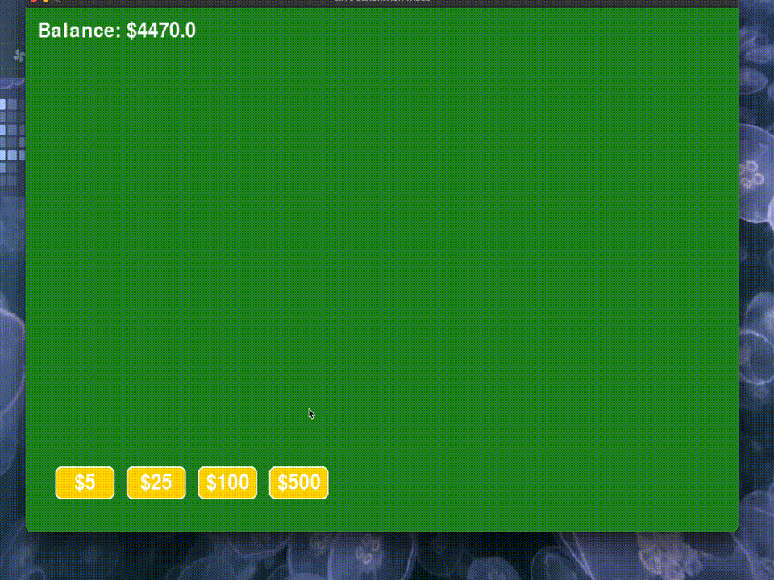

# Blackjack Table Game

This is an interactive Blackjack game built in Python. The project started as a console-based implementation in `blackjack.py` for a class and later evolved into GUI version after some experimentation with Pygame.

The game simulates a classic blackjack table where players can place bets, receive cards, and play against a dealer following standard blackjack rules. While the original version operated entirely via the command line, the GUI version provides cooler and more interactive user experience.

## Demo

